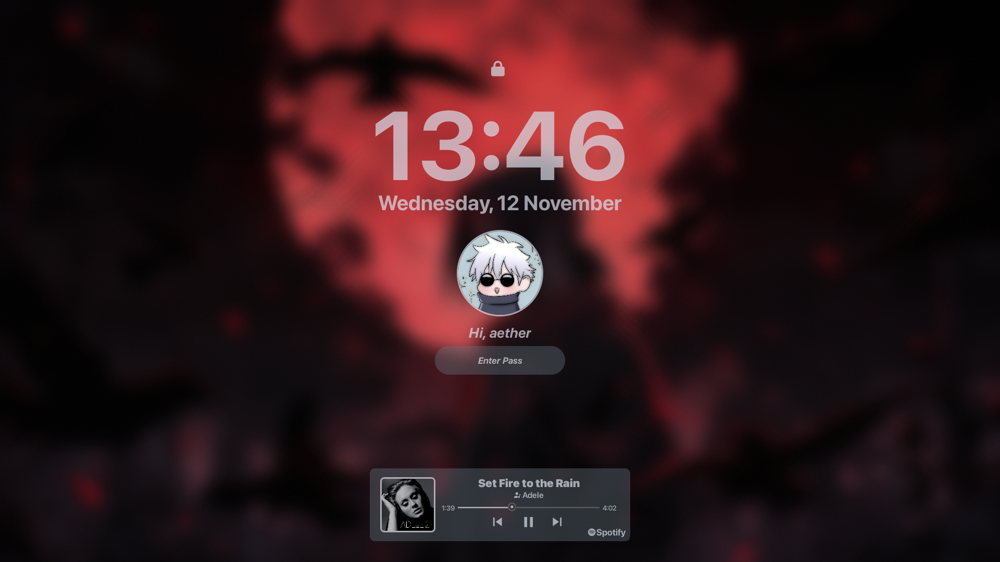
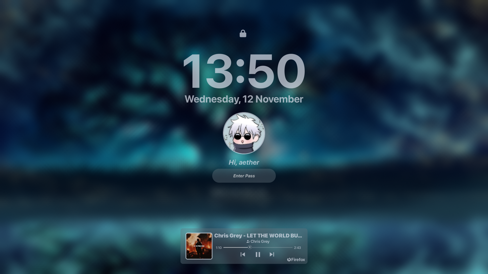
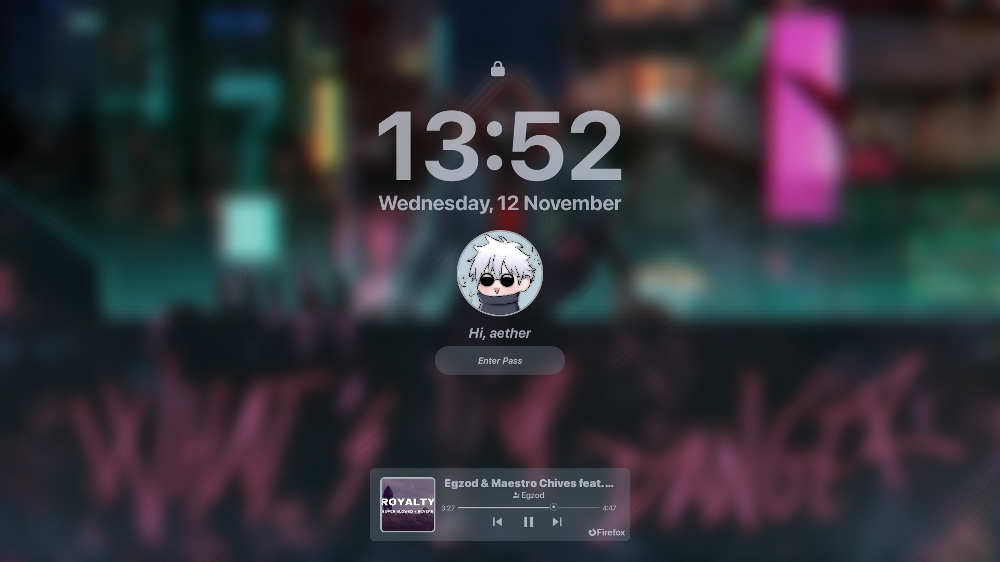
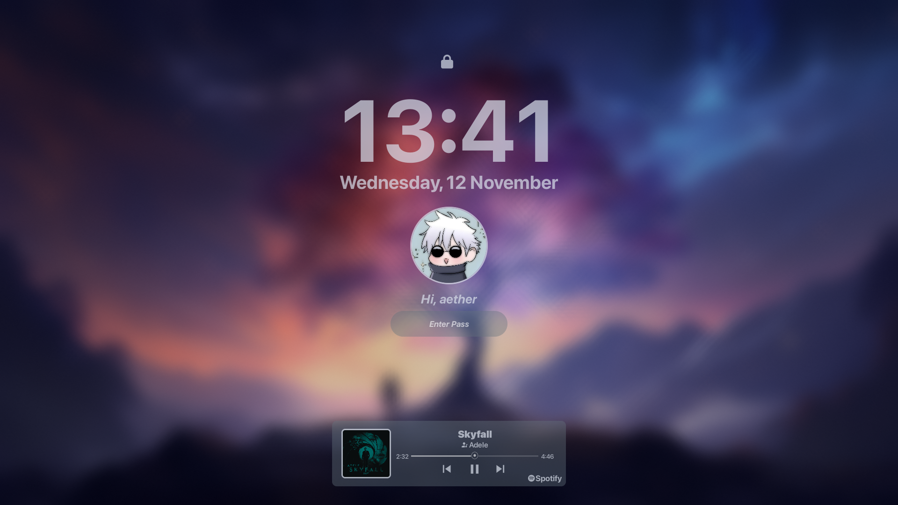

# 🌌 Hyprlock – Custom Glassy Music Lock Screen

A clean and modern **Hyprlock** configuration with integrated music player, glassy blur effects, and dynamic album art.  
Built for **Hyprland** on Arch Linux, inspired by community designs and refined through lots of experimentation.

---

## 🖼️ Preview

| Lock Screen |
|--------------|
|  |

---

## ✨ Features

- 🎵 **Live Music Integration**  
  Real-time display of current track, artist, and album art with player detection (Spotify, Firefox, Brave, MPV, VLC…)
  
- 🟦 **Glassy & Minimal Design**  
  Smooth blurred background and soft rounded corners for a clean aesthetic.
  
- 📊 **Custom Progress Bar**  
  Two progress bar implementations — one active and one commented-out alternative (both work).
  
- 🎨 **Configurable Layout**  
  Centered time, user avatar, and lock input field with flexible positioning.

---

## 🧠 System Info

| Component | Details |
|------------|----------|
| **OS** | Arch Linux |
| **WM** | Hyprland |
| **Lockscreen** | Hyprlock |
| **Music Players Tested** | Spotify, Firefox (YouTube Music) |
| **Font** | SF Pro Display |
| **Resolution** | 1920×1080 |

---

## ⚙️ Dependencies

Make sure you have these installed:
```bash
sudo pacman -S hyprlock playerctl imagemagick
```

---

## 💡 Inspiration & Credits

* [**MrVivekRajan/Hyprlock-Styles**](https://github.com/MrVivekRajan/Hyprlock-Styles) – Base theme & layout ideas
* [**Thunder-Blaze/BlazinLock**](https://github.com/Thunder-Blaze/BlazinLock) – Music widget inspiration
* [**ChatGPT**](https://chat.openai.com) & [**Claude AI**](https://claude.ai) – For helping refine player detection and scripting logic

---

## 📦 Installation

Clone this repo:

```bash
git clone https://github.com/A3TH3Rr/Hyprlock.git
cd hyprlock-glassy-music
```

Then copy the files:

```bash
cp -r * ~/.config/hypr/
```

Finally, test it:

```bash
hyprlock
```

---

## 💬 Feedback

I’d love to hear your ideas for improvement!
Especially if you know how to make the **progress bar smoother** — please open an issue or PR with your ideas. 🙏

---

## 📸 Screenshots
<p align="center">
  
  
</p>

<p align="center">
  
</p>


---

## 📜 License

MIT License © A3TH3Rr
